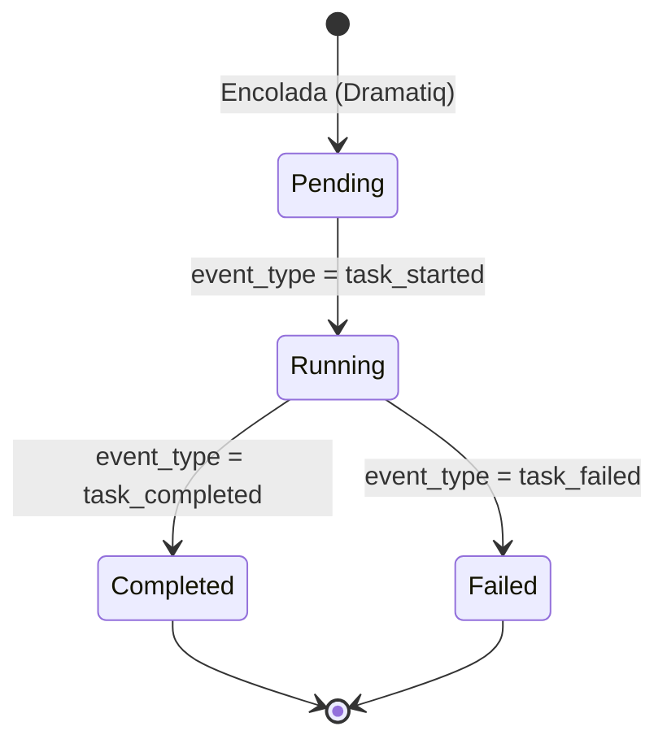
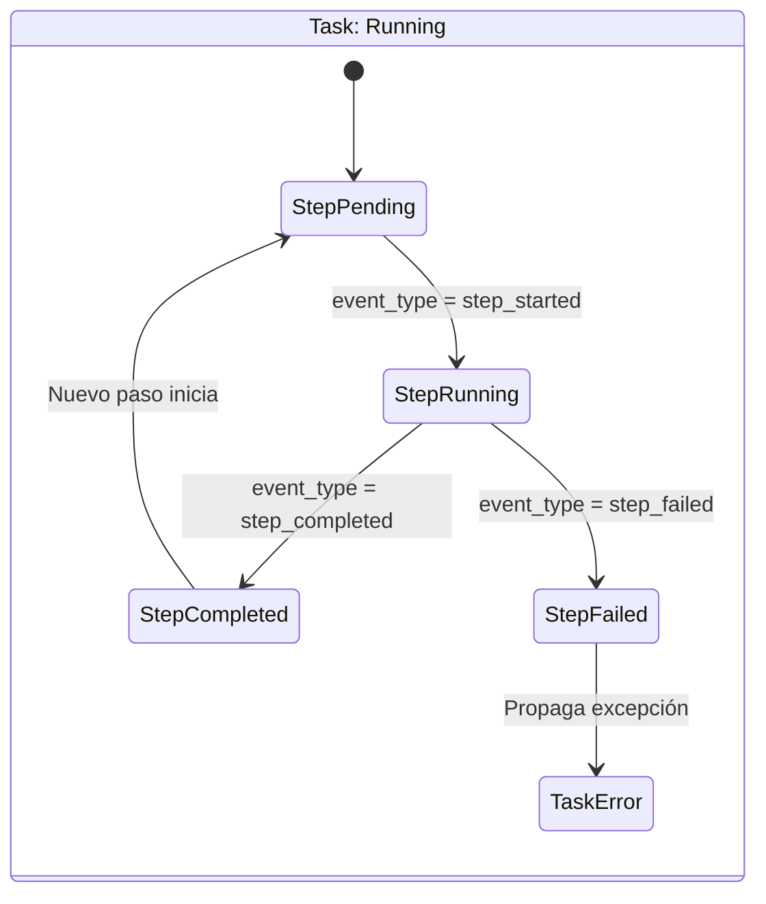

# Máquina de Estados de Tareas (TaskRunner)

Toda tarea asíncrona orquestada por el `AsyncTaskRunner` sigue un flujo de estados estricto. El Frontend debe reaccionar a estos estados para reflejar el progreso.

## Flujo Global de la Tarea

## Flujo de los Pasos Internos (Steps)

Mientras la tarea global está en estado `Running`, la tarea emite eventos atómicos sobre sus pasos internos.

## Cálculos de Progreso (Frontend)

El backend reporta el `weight` (peso) relativo de cada paso.
Para calcular la barra de progreso general, el frontend puede sumar los pesos de los pasos completados.

Fórmula sugerida (para UI optimista):
`Progreso % = Suma(pesos de steps completados) + (peso step actual * 0.5)`

*(El 0.5 asume que el paso en curso está a medias. Cuando llegue el evento `step_completed`, se suma el peso completo).*
